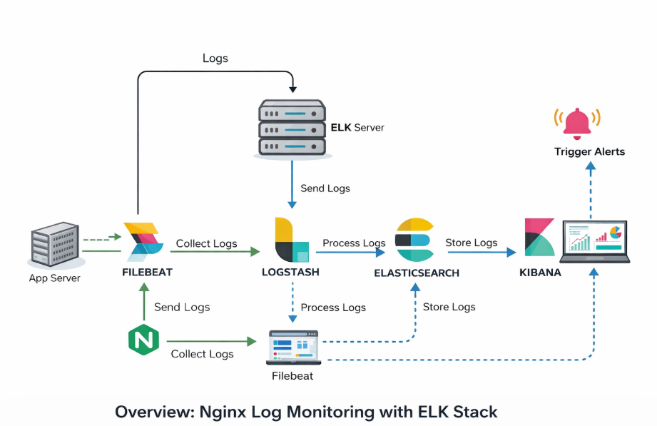
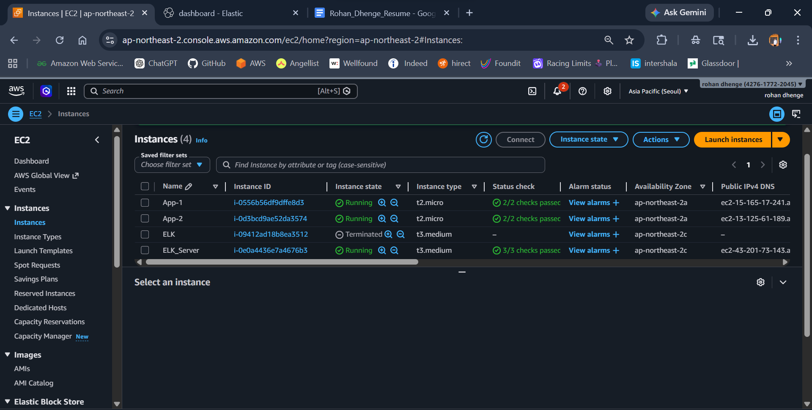
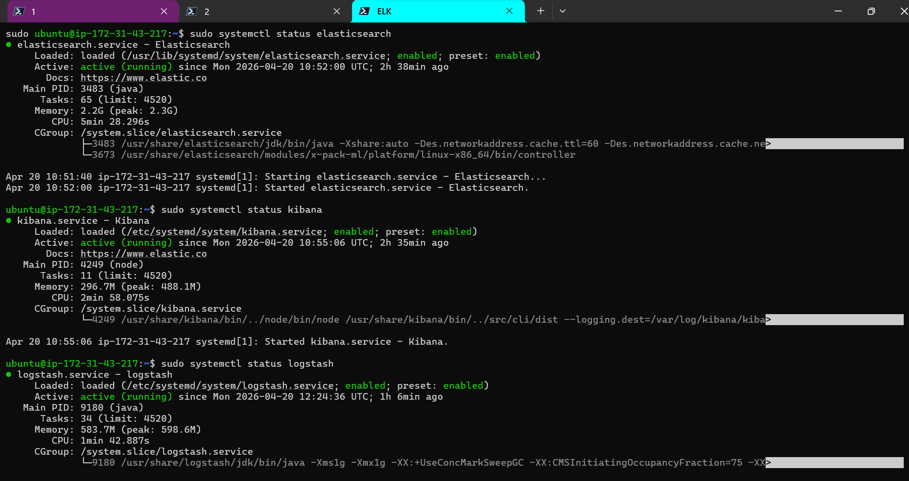
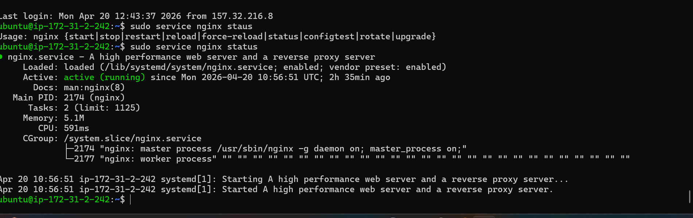
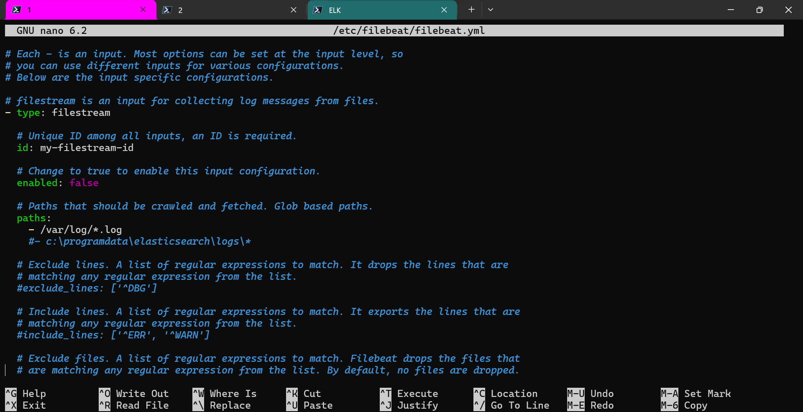
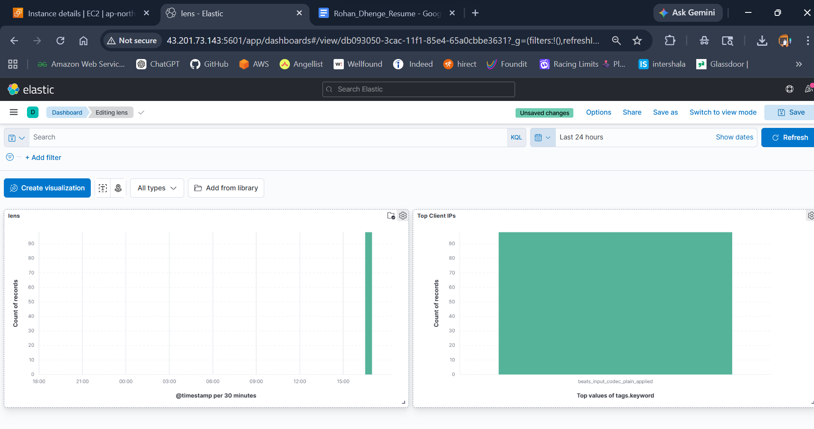

# 🚀 Centralized Log Aggregation & Monitoring using ELK Stack

---

## 📌 Project Overview

This project implements a centralized logging system using the ELK Stack (Elasticsearch, Logstash, Kibana) to collect, process, and visualize logs from multiple servers.

It eliminates the problem of scattered logs and enables:

* Faster debugging
* Real-time monitoring
* Proactive alerting



---

## 🎯 Objective

* Collect logs from multiple EC2 instances
* Parse and filter logs (4xx, 5xx errors)
* Store logs in Elasticsearch
* Visualize logs in Kibana
* Trigger alerts on abnormal error spikes

---

## 🏗️ Architecture

```
EC2 (App Server 1) ----\
                        \
EC2 (App Server 2) -----> Filebeat ---> Logstash ---> Elasticsearch ---> Kibana
```

---

## 🛠️ Tech Stack

* AWS EC2
* Elasticsearch
* Logstash
* Kibana
* Filebeat
* Nginx


---


## ⚙️ Step 1: ELK Server Setup

### 🔹 Update System

```bash
sudo apt update && sudo apt upgrade -y
```

---

### 🔹 Install Java

```bash
sudo apt install openjdk-11-jdk -y
java -version
```

---

### 🔹 Install Elasticsearch

```bash
wget https://artifacts.elastic.co/downloads/elasticsearch/elasticsearch-7.17.0-amd64.deb
sudo dpkg -i elasticsearch-7.17.0-amd64.deb

sudo systemctl daemon-reexec
sudo systemctl enable elasticsearch
sudo systemctl start elasticsearch
```

---

### 🔹 Verify Elasticsearch

```bash
curl http://localhost:9200
```

---

### 🔹 Install Logstash

```bash
wget https://artifacts.elastic.co/downloads/logstash/logstash-7.17.0-amd64.deb
sudo dpkg -i logstash-7.17.0-amd64.deb
```

---

### 🔹 Install Kibana

```bash
wget https://artifacts.elastic.co/downloads/kibana/kibana-7.17.0-amd64.deb
sudo dpkg -i kibana-7.17.0-amd64.deb

sudo systemctl enable kibana
sudo systemctl start kibana
```


---

### 🔹 Configure Kibana

```bash
sudo nano /etc/kibana/kibana.yml
```

```bash
server.host: "0.0.0.0"
```

---

## 🌐 Step 2: Application Servers Setup

### 🔹 Install Nginx

```bash
sudo apt update
sudo apt install nginx -y
sudo systemctl start nginx
```



---

### 🔹 Generate Logs

```bash
curl localhost
```

---

### 🔹 Install Filebeat

```bash
wget https://artifacts.elastic.co/downloads/beats/filebeat/filebeat-7.17.0-amd64.deb
sudo dpkg -i filebeat-7.17.0-amd64.deb
```

---

### 🔹 Configure Filebeat

```bash
sudo nano /etc/filebeat/filebeat.yml
```

```bash
filebeat.inputs:
- type: log
  enabled: true
  paths:
    - /var/log/nginx/access.log
    - /var/log/nginx/error.log

output.logstash:
  hosts: ["<ELK_SERVER_PRIVATE_IP>:5044"]
```


---


### 🔹 Start Filebeat

```bash
sudo systemctl enable filebeat
sudo systemctl start filebeat
```

---

## 🔄 Step 3: Logstash Configuration

```bash
sudo nano /etc/logstash/conf.d/logstash.conf
```

```bash
input {
  beats {
    port => 5044
  }
}

filter {
  if [message] =~ " 4[0-9][0-9] " {
    mutate { add_tag => ["4xx_error"] }
  }

  if [message] =~ " 5[0-9][0-9] " {
    mutate { add_tag => ["5xx_error"] }
  }
}

output {
  elasticsearch {
    hosts => ["http://localhost:9200"]
    index => "nginx-logs-%{+YYYY.MM.dd}"
  }
}
```


---


### 🔹 Start Logstash

```bash
sudo systemctl enable logstash
sudo systemctl start logstash
```

---

## 📊 Step 4: Kibana Dashboard Setup

### 🔹 Access Kibana

```bash
http://35.91.208.211:5601
```


---

### 🔹 Create Index Pattern

```bash
nginx-logs-*
```


---


### 🔹 Create Visualizations


---

## 🚨 Step 5: Alert Configuration

### 🔹 Navigate

```bash
Stack Management → Alerts → Create Rule
```

---

```

---

### 🔹 Action

```bash
Email / Webhook notification
```

---

## 🔍 Verification

### 🔹 Check Elasticsearch Indices

```bash
curl http://localhost:9200/_cat/indices?v
```

---

### 🔹 Check Filebeat Logs

```bash
sudo journalctl -u filebeat -f
```

---

### 🔹 Check Logstash Logs

```bash
sudo journalctl -u logstash -f
```

---

## 📦 Deliverables

* Log pipeline configuration
* Kibana dashboard screenshots
* Alert configuration proof
* Complete working setup


---

## 🔄 Data Flow

1. Nginx generates logs
2. Filebeat ships logs
3. Logstash parses logs
4. Elasticsearch stores logs
5. Kibana visualizes logs
6. Alerts trigger on error spikes

---

## 💡 Future Improvements

* Add authentication (Elastic Security)
* Slack integration for alerts
* Use AWS OpenSearch
* Advanced parsing using Grok filters
